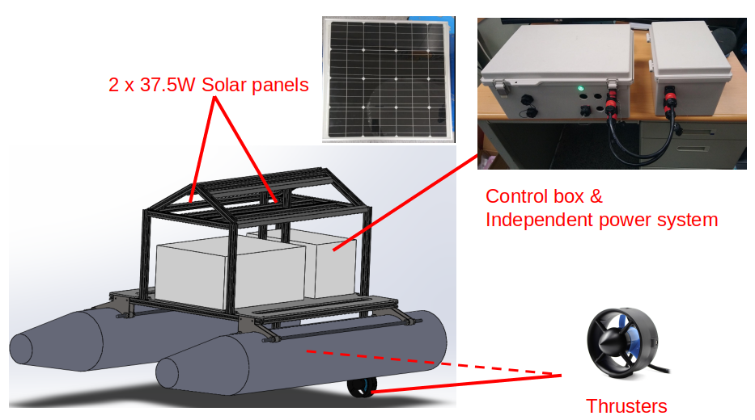
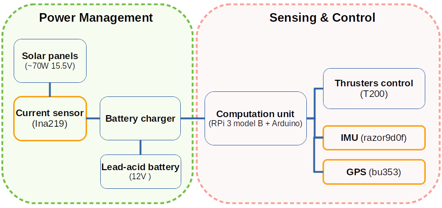

# robotx_bionic
The repo is prepared for the bionic technology project. It includes power management, computation unit, sensing and control system.

<p align="center"></img></p>
<p align="center"></img></p>

------

# How to run
## Record Sensor data on Raspberry Pi3
Connect to "jason_car" Wi-Fi hotspot first.

```bash
laptop $ ssh agvduck@10.42.0.1       # pwd: agvduck
rpi3 $ byobu
```
Press **F2** to open a new terminal, **F3/F4** means left/right terminal switching.
terminal 1: Turn on current sensor
```bash
rpi3 $ source ~/robotx_bionic/environment.sh
rpi3 $ roslaunch rasberrypi_sensors temp_current.launch 
```
terminal 2: Turn on GPS
```bash
rpi3 $ source ~/robotx_bionic/environment.sh
rpi3 $ roslaunch robotx_bionic sensor.launch 
```
terminal 3:
```bash
rpi3 $ source ~/robotx_bionic/environment.sh
rpi3 $ rosbag record /fix /temp_current_8A_node/temp_current --chunksize=1
```

------

## Transfer sensor data to xls file from a rosbag file (Laptop)

```bash
laptop $ byobu
```
terminal 1:
```bash
laptop $ roscore
```
terminal 2:
```bash
laptop $ roslaunch robotx_bionic data_to_xls.launch starting_time:=[CORRECT_TIME_STAMP]   # e.g 2018-10-02-10-43-00
```
terminal 3:
```bash
laptop $  rosbag play BAGNAME.bag --rate=[SPEED_OF_BAG_PLAYING]
```

------

## Recover incomplete bag (\*.bag.active)

```bash
laptop $ rosbag reindex xxx.bag.active
laptop $ rosbag fix xxx.bag.active xxx.bag
laptop $ rm -f *.orig.active
```